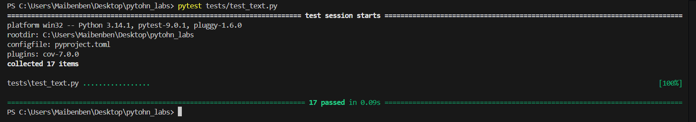
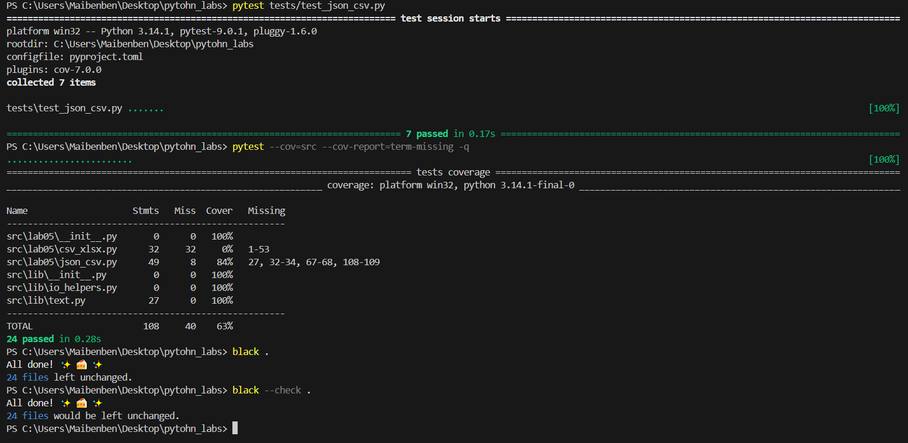

# ЛР7 — Тестирование: pytest + стиль (black)
## A Тесты для src/lib/text.py
```python
import pytest
import sys
import os

sys.path.append(os.path.join(os.path.dirname(__file__), ".."))
from src.lib.text import *


@pytest.mark.parametrize(
    "source, expected",
    [
        ("ПрИвЕт\nМИр\t", "привет мир"),
        ("ёжик, Ёлка", "eжик, eлка"),
        ("Hello\r\nWorld", "hello world"),
        ("  двойные   пробелы  ", "двойные пробелы"),
        ("", ""),
        ("   ", ""),
    ],
)
def test_normalize(source, expected):
    assert normalize(source) == expected


@pytest.mark.parametrize(
    "text, expected",
    [
        ("привет мир", ["привет", "мир"]),
        ("hello world test", ["hello", "world", "test"]),
        ("", []),
        ("   ", []),
        ("знаки, препинания! тест.", ["знаки", "препинания", "тест"]),
    ],
)
def test_tokenize(text, expected):
    assert tokenize(text) == expected


def test_count_freq_basic():
    tokens = ["apple", "banana", "apple", "cherry", "banana", "apple"]
    result = count_freq(tokens)
    expected = {"apple": 3, "banana": 2, "cherry": 1}
    assert result == expected


def test_count_freq_empty():
    assert count_freq([]) == {}


def test_top_n_basic():
    freq = {"apple": 5, "banana": 3, "cherry": 7, "date": 1}
    result = top_n(freq, 2)
    expected = [("cherry", 7), ("apple", 5)]
    assert result == expected


def test_top_n_tie_breaker():
    freq = {"banana": 3, "apple": 3, "cherry": 3}
    result = top_n(freq, 3)
    expected = [("apple", 3), ("banana", 3), ("cherry", 3)]
    assert result == expected


def test_top_n_empty():
    assert top_n({}, 5) == []


def test_full_pipeline():
    text = "Привет мир! Привет всем. Мир прекрасен."
    normalized = normalize(text)
    tokens = tokenize(normalized)
    freq = count_freq(tokens)
    top_words = top_n(freq, 2)

    assert normalized == "привет мир! привет всем. мир прекрасен."
    assert tokens == [
        "привет",
        "мир",
        "привет",
        "всем",
        "мир",
        "прекрасен",
    ]
    assert freq == {"привет": 2, "мир": 2, "всем": 1, "прекрасен": 1}
    assert top_words == [("мир", 2), ("привет", 2)]

```

# B Тесты для src/lab05/json_csv.py
```python
import pytest
import json
import csv
import sys
import os

sys.path.append(os.path.join(os.path.dirname(__file__), ".."))
from src.lab05.json_csv import json_to_csv, csv_to_json


def test_json_to_csv_basic(tmp_path):
    """Базовый тест: проверяет, корректно ли преобразуется простой JSON-список в CSV-файл.
    Teste básico: verifica se uma lista JSON simples
    é corretamente convertida para um arquivo CSV.
    """

    # Dados de entrada (JSON)
    # Входные данные (JSON)
    data = [{"name": "Maria", "age": 22}, {"name": "João", "age": 28}]

    # Arquivos temporários para teste
    # Временные файлы для тестирования
    src = tmp_path / "data.json"
    dst = tmp_path / "data.csv"

    # Criamos o arquivo JSON Мы создали JSON-файл.
    src.write_text(json.dumps(data), encoding="utf-8")

    # Chamamos a função que deve converter para CSV
    #  Мы вызываем функцию, которая должна выполнить преобразование в формат CSV.
    json_to_csv(str(src), str(dst))

    # Verifica se o arquivo de saída foi criado
    # Проверяет, был ли создан выходной файл.
    assert dst.exists()

    # Lê o CSV e verifica se o conteúdo está correto
    # Прочитайте CSV-файл и проверьте правильность его содержимого.
    with dst.open(encoding="utf-8") as f:
        rows = list(csv.DictReader(f))

    assert len(rows) == 2  # Deve ter 2 linhas Должно быть две строки.
    assert (
        rows[0]["name"] == "Maria"
    )  # Verifica o conteúdo convertido Проверьте преобразованное содержимое.


def test_json_to_csv_invalid_json(tmp_path):
    """Сообщение об ошибке: Файл содержит недопустимый JSON.
    Функция должна генерировать исключение ValueError.
        Teste de erro: o arquivo contém JSON inválido.
        A função deve lançar um ValueError.
    """

    src = tmp_path / "broken"
    dst = tmp_path / "data.csv"

    # Escrevemos um JSON quebrado
    # Мы написали некорректный JSON.
    src.write_text("{ invalid json }", encoding="utf-8")

    # A função deve falhar
    # Функция должна завершиться ошибкой.
    # with pytest.raises(ValueError):
    #   json_to_csv(str(src), str(dst))
    assert json_to_csv(str(src), str(dst)) is False


def test_csv_to_json_basic(tmp_path):
    """Базовая проверка: проверяет, правильно ли простой CSV-файл преобразуется в JSON.
    Teste básico: verifica se um CSV simples é corretamente
    convertido para JSON.
    """

    src = tmp_path / "data.csv"
    dst = tmp_path / "data.json"

    # Criamos um CSV manualmente
    # Мы создали CSV-файл вручную.
    src.write_text("name,age\nCarlos,40\nFernanda,35", encoding="utf-8")

    # Convertendo para JSON
    # Преобразование в JSON
    csv_to_json(str(src), str(dst))

    assert dst.exists()  # Arquivo JSON deve existir Файл JSON должен существовать.

    with dst.open(encoding="utf-8") as f:
        data = json.load(f)

    assert len(data) == 2  # Duas linhas Должно быть две строки.
    assert (
        data[0]["name"] == "Carlos"
    )  # Verifica conteúdo Проверьте преобразованное содержимое


def test_csv_to_json_empty_file(tmp_path):
    """Сообщение об ошибке: CSV-файл пуст.
    Функция должна генерировать исключение ValueError.
        Teste de erro: CSV está vazio.
        A função deve lançar ValueError.
    """

    src = tmp_path / "empty.csv"
    dst = tmp_path / "data.json"

    src.write_text("", encoding="utf-8")  # CSV vazio

    # with pytest.raises(ValueError):
    assert csv_to_json(str(src), str(dst)) is False


def test_roundtrip(tmp_path):
    """Протестируйте полный цикл:

    JSON → CSV → JSON

    и убедитесь, что данные остаются неизменными.
        Testa o ciclo completo:
        JSON → CSV → JSON
        e verifica se os dados permanecem iguais.
    """

    original = [{"name": "Luana", "age": 19}]

    j1 = tmp_path / "orig.json"
    csv_file = tmp_path / "data.csv"
    j2 = tmp_path / "final.json"

    # Escreve o JSON inicial
    j1.write_text(json.dumps(original), encoding="utf-8")

    # Converte para CSV e depois volta para JSON
    json_to_csv(str(j1), str(csv_file))
    csv_to_json(str(csv_file), str(j2))

    # Lê o resultado final
    with j2.open(encoding="utf-8") as f:
        result = json.load(f)

    assert len(result) == 1
    assert {"name", "age"} <= set(
        result[0].keys()
    )  # Os dados devem ser exatamente iguais Данные должны быть абсолютно идентичными.


def test_wrong_json_extension(tmp_path):
    """Проверка на ошибку:

    Файл имеет расширение .txt, но содержит JSON.

    Функция должна сообщить о некорректном расширении.
        Teste de erro:
        Arquivo tem extensão .txt mas contém JSON.
        A função deve informar que a extensão está errada.
    """

    src = tmp_path / "data.txt"
    dst = tmp_path / "data.csv"

    src.write_text('[{"name": "Gabriel"}]', encoding="utf-8")

    assert json_to_csv(str(src), str(dst)) is False


def test_wrong_csv_extension(tmp_path):
    """Проверка ошибки:

    Файл имеет расширение .txt, но содержит CSV-файл.

    Функция должна генерировать исключение ValueError.

    ""
        Teste de erro:
        Arquivo tem extensão .txt mas contém CSV.
        A função deve lançar ValueError.
    """

    src = tmp_path / "data.txt"
    dst = tmp_path / "data.json"

    src.write_text("name,age\nHelena,33", encoding="utf-8")

    # with pytest.raises(ValueError):

    assert csv_to_json(str(src), str(dst)) is True

```
# Teste A


# Teste B

