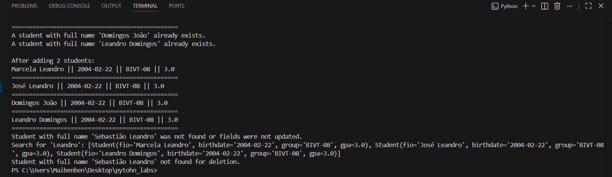
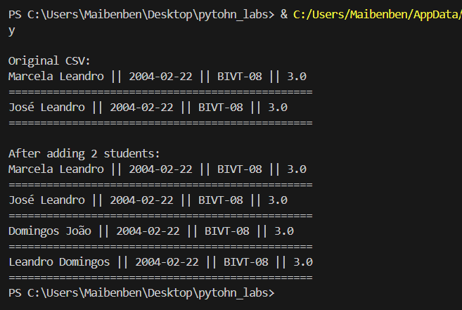
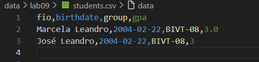
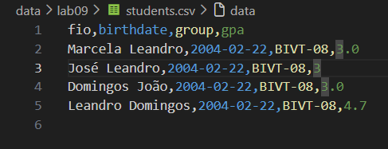
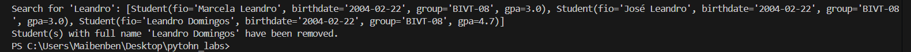

## ЛР9 — «База данных» на CSV: класс Group, CRUD-операции и CLI

## Задание A Реализовать класс Group, содержащий:

``` Python  


import csv
from pathlib import Path
from typing import List
from lab08.models import Student
from lib.text import count_freq
from lab02.arrays import min_max


class Group:
    HEADER = ["fio", "birthdate", "group", "gpa"]

    def __init__(self, storage_path: str):
        self.path = Path(storage_path)
        self._ensure_storage_exists()

    def _ensure_storage_exists(self):
        """Creates a header file if it doesn't already exist."""
        if not self.path.exists():
            with open(self.path, mode='w', newline='', encoding='utf-8') as f:
                writer = csv.writer(f)
                writer.writerow(self.HEADER)

    def _read_all_raw(self) -> dict:
        """Read all lines from CSV as a list of dictionaries."""
        with open(self.path, 'r', newline='', encoding='utf-8') as f:
            reader = csv.DictReader(f)
            if reader.fieldnames != self.HEADER:
                raise ValueError(f"Invalid CSV file header when reading. Expected {self.HEADER}")
            return list(reader)

    def _write_all_raw(self, data: List[dict]):
        """Overwrite the entire CSV file with new data."""
        with open(self.path, mode='w', newline='', encoding='utf-8') as f:
            writer = csv.DictWriter(f, fieldnames=self.HEADER)
            writer.writeheader()
            writer.writerows(data)

    def list(self):
        """Return all students as a Student list."""
        raw_data = self._read_all_raw() #Get data from the CSV file
        student=""
        students = []
        for row in raw_data:
            try:
                # Validation: Each row matches a valid Student object
                student = Student.from_dict(row)
                students.append(student)
            except (ValueError, TypeError) as e:
                print(f"String validation error {row}: {e}")
                continue
        return students

    def add(self, student: Student):
        """Add a new student to CSV."""
        if not isinstance(student, Student): #Invalid student data.
            raise TypeError("The object must be an instance of the Student class.")

        # We check whether a student with the same full name already exists (as a simple key)
        existing_students = self._read_all_raw()
        if any(s['fio'] == student.fio for s in existing_students):
            print(f"A student with full name '{student.fio}' already exists.")
            return
        #Add the nwe student
        with open(self.path, mode='a', newline='', encoding='utf-8') as f:
            writer = csv.DictWriter(f, fieldnames=self.HEADER, lineterminator='\n')
            writer.writerow(student.to_dict())

    def find(self, substr: str) -> List[Student]:
        """Find students by substring in fio."""
        all_students = self.list()
        return print(f"Search for '{substr}':", [student for student in all_students if substr.lower() in student.fio.lower()])

    def remove(self, fio: str):
        """Delete record(s) with this full name."""
        rows = self._read_all_raw()
        initial_count = len(rows) #How many registers in CSV file.
        # We filter all the lines, leaving only those where fio does not match
        updated_rows = [row for row in rows if row["fio"] != fio]

        #If initial Length is equals to the final length:
        if len(updated_rows) == initial_count:
            print(f"Student with full name '{fio}' not found for deletion.")
        else:
            self._write_all_raw(updated_rows) #Otherwise...
            print(f"Student(s) with full name '{fio}' have been removed.")

    def update(self, fio: str, **fields):
        """Update fields of an existing student."""
        rows = self._read_all_raw() #1st, read all CSV file.
        updated = False #flag
        for row in rows:
            if row["fio"] == fio:
                for key, value in fields.items():
                    #If Key is valid (belongs to HEADER) and if it is not the "fio" key:
                    if key in self.HEADER and key != 'fio': # FIO cannot be changed by "update" method.
                        row[key] = str(value) # Convert to a string for writing to CSV
                        updated = True
                    elif key != 'fio':
                         print(f"Warning: The '{key}' field is ignored because it is not in the CSV header.")
                break # Stop after the first match (if fio is unique)

        if updated:
            self._write_all_raw(rows) #Write to the CSV file updated data
            print(f"Entries for '{fio}' updated successfully.")
        else:
            print(f"Student with full name '{fio}' was not found or fields were not updated.")
    
    #--------------------------------------------------------------------------------------# 
def print_list(title, students: Student):
    print("\n" + title)
    n = ""
    for s in students:
        print(f"{s.fio} || {s.birthdate} || {s.group} || {s.gpa}")
        print(f"================================================")


if __name__ == "__main__":

    g = Group("data/lab09/students.csv")

    print_list("Original CSV: ",g.list())
    """
    new_st = Student("Domingos João", "2004-02-22", "BIVT-08", 3.0)
    g.add(new_st)
    new_st = Student("Leandro Domingos", "2004-02-22", "BIVT-08", 3)
    g.add(new_st)
    print_list("After adding 2 students:", g.list())
    """
    #g.update("Leandro Domingos", gpa=4.7)

    g.find("Leandro")  # searching by substring

    g.remove("Leandro Domingos")

 
```

## Exercicío 





## вернуть всех студентов в виде списка Student



##  добавить нового студента в CSV



##  обновить поля существующего студента


## удалить запись(и) с данным fio

