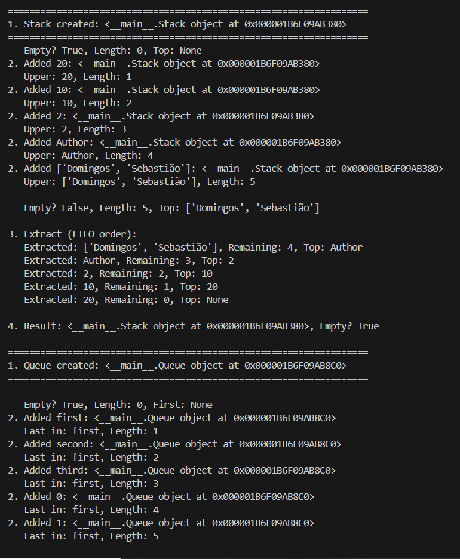
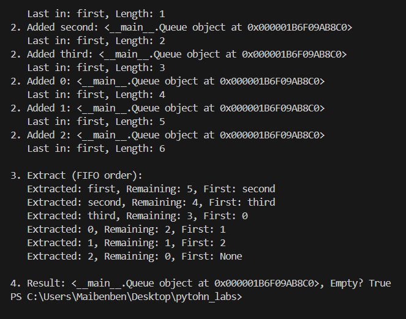
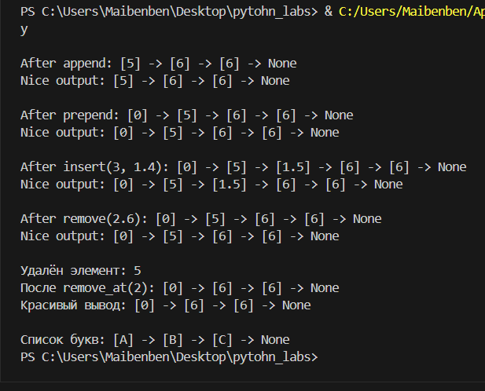

## ЛР10 — Структуры данных: Stack, Queue, Linked List и бенчмарки

 
## A. Реализовать Stack и Queue (src/lab10/structures.py)


## src/lab10/structures.py

``` python 

from collections import deque
from typing import Any


class Stack:
    """Структура данных типа стек (LIFO), основанная на списке.."""  # «стек»

    def __init__(self):
        self._data: list[Any] = []

    def push(self, item: Any) -> None:
        """Add an element to the top of the stack."""
        self._data.append(item)

    def pop(self) -> Any:
        """Удаляет верхний элемент стека и возвращает его.."""
        if self.is_empty():
            raise IndexError("pop from empty stack")
        return self._data.pop()

    def peek(self) -> Any | None:
        """Возвращает верхний элемент, не удаляя его. Возвращает None, если стек пуст."""
        if self.is_empty():
            return None
        return self._data[-1]

    def is_empty(self) -> bool:
        """Возвращает True, если стек пуст, в противном случае — False.."""
        return len(self._data) == 0

    def __len__(self) -> int:
        """Количество элементов в стеке."""
        return len(self._data)


class Queue:
    """Структура данных FIFO, основанная на collections.deque.."""  # «очередь»

    def __init__(self):
        self._data: deque[Any] = deque()

    def enqueue(self, item: Any) -> None:
        """Добавить элемент в конец очереди."""
        self._data.append(item)

    def dequeue(self) -> Any:
        """
       Удаляет левый элемент из начала очереди и возвращает его.

Если очередь пуста, возвращает исключение IndexError..
        """
        if self.is_empty():
            raise IndexError("dequeue from empty queue")
        return self._data.popleft()

    def peek(self) -> Any | None:
        """Возвращает первый элемент, не удаляя его. Возвращает None, если очередь пуста.."""
        if self.is_empty():
            return None
        return self._data[0]

    def is_empty(self) -> bool:
        """Возвращает True, если очередь пуста.."""
        return len(self._data) == 0

    def __len__(self) -> int:
        """Количество элементов в очереди."""
        return len(self._data)


                            #--Test all--#


if __name__ == "__main__":
                                     #LIFO-#
    stack = Stack()
    print("\n===================================================================")
    print(f"1. Stack created: {stack}")
    print("===================================================================")

    print(f"   Empty? {stack.is_empty()}, Length: {len(stack)}, Top: {stack.peek()}")

    elements = [20, 10, 2, "Author", ["Domingos", "Sebastião"]]
    for elem in elements:
        # Выполнение LIFO
        stack.push(elem)  # Добавление новых элементов в начало списка
        print(f"2. Added {elem}: {stack}")  # Отображение добавленного элемента
        print(f"   Upper: {stack.peek()}, Length: {len(stack)}")  # Элемент сверху

    print(f"\n   Empty? {stack.is_empty()}, Length: {len(stack)}, Top: {stack.peek()}")

    print("\n3. Extract (LIFO order):")
    while not stack.is_empty():  # Извлечение элементов из верхней части списка
        item = stack.pop()  # Экстракция
        print(f"   Extracted: {item}, Remaining: {len(stack)}, Top: {stack.peek()}")

    print(f"\n4. Result: {stack}, Empty? {stack.is_empty()}")

                                     # -Fifo-#
    q = Queue()

    # Fifo Инициализация
    print("\n===================================================================")
    print(f"1. Queue created: {q}")
    print("===================================================================")
    print(f"\n   Empty? {q.is_empty()}, Length: {len(q)}, First: {q.peek()}")

    # Добавление элементов
    elements = ["first", "second", "third", 0, 1, 2]
    for element in elements:
        q.enqueue(element)
        print(f"2. Added {element}: {q}")
        print(f"   Last in: {q.peek()}, Length: {len(q)}")

    # Извлечение элементов
    print("\n3. Extract (FIFO order):")
    while not q.is_empty():
        item = q.dequeue()
        print(f"   Extracted: {item}, Remaining: {len(q)}, First: {q.peek()}")

    # Результат
    print(f"\n4. Result: {q}, Empty? {q.is_empty()}")


```


##  B. Реализовать SinglyLinkedList (src/lab10/linked_list.py)

``` Python
from typing import Any, Optional, Iterator


class Node:
    """Singly linked list node."""

    def __init__(self, value: Any, next: Optional["Node"] = None):
        self.value = value 
        self.next = next

    def __repr__(self) -> str:
        """A string representation of the node as [value]."""
        return f"[{self.value}]"


class SinglyLinkedList:
    """Singly linked list."""

    def __init__(self):
        self.head: Optional[Node] = None
        self.tail: Optional[Node] = None  # to speed up append
        self._size: int = 0

    def append(self, value: Any) -> None:
        """Add an element to the end of a list in O(1) time using tail."""
        new_node = Node(value)

        if self.head is None:
            self.head = new_node
            self.tail = new_node
        else:
            assert (
                self.tail is not None
            )  # Проверка типов: tail не равен None, если head не равен None.
            self.tail.next = new_node
            self.tail = new_node

        self._size += 1

    def prepend(self, value: Any) -> None:
        """Add an element to the beginning of a list in O(1)."""
        new_node = Node(value, next=self.head)
        self.head = new_node

        # Если список был пуст, обновите хвост.
        if self.tail is None:
            self.tail = new_node

        self._size += 1

    def insert(self, idx: int, value: Any) -> None:
        """Insert an element at index idx."""
        # Проверка корректности индекса
        if idx < 0 or idx > self._size:
            raise IndexError(f"Index {idx} out of range [0, {self._size}]")

        # Вставить в начало
        if idx == 0:
            self.prepend(value)
            return

        # Вставка в конец
        if idx == self._size:
            self.append(value)
            return

        # Middle insert
        assert (
            self.head is not None
        )  # Проверка типов: head не равен None при вставке в середину.
        current = self.head
        for _ in range(idx - 1):
            assert (
                current.next is not None
            )  # Type checker: current.next is not None during traversal
            current = current.next

        new_node = Node(value, next=current.next)
        current.next = new_node
        self._size += 1

    def remove(self, value: Any) -> bool:
        """Удаляет первое вхождение значения. Возвращает True, если элемент был удален.."""
        if self.head is None:
            return False

        # Удалить с самого начала
        if self.head.value == value:
            self.head = self.head.next
            #Если список станет пустым, обновите хвост.
            if self.head is None:
                self.tail = None
            self._size -= 1
            return True

        # Поиск элемента для удаления
        current = self.head
        while current.next is not None:
            if current.next.value == value:
                # Удалите элемент
                current.next = current.next.next
                # Если последний элемент был удален, обновите хвост.
                if current.next is None:
                    self.tail = current
                self._size -= 1
                return True
            current = current.next

        return False

    def remove_at(self, idx: int) -> Any:
        """Удаляет элемент по индексу idx и возвращает его значение.."""
        if idx < 0 or idx >= self._size:
            raise IndexError(f"Index {idx} out of range [0, {self._size - 1}]")

        assert self._size > 0  # Проверка типов: размер > 0 означает, что заголовок не равен None.
        assert self.head is not None  # Проверка типов: head не равен None, когда размер > 0

        # Удаление с самого начала
        if idx == 0:
            value = self.head.value
            self.head = self.head.next
            # Если список станет пустым, обновите хвост.
            if self.head is None:
                self.tail = None
            self._size -= 1
            return value

        # Удаление из середины или конца
        current = self.head
        for _ in range(idx - 1):
            assert (
                current.next is not None
            )  # Проверка типов: current.next не равен None во время обхода
            current = current.next

        assert (
            current.next is not None
        )  # Проверка типов: current.next не равен None для удаления.
        value = current.next.value
        current.next = current.next.next

        # Если последний элемент был удален, обновите хвост.
        if current.next is None:
            self.tail = current

        self._size -= 1
        return value

    def __iter__(self) -> Iterator[Any]:
        """Итератор по значениям в списке (от начала до конца).."""
        current = self.head
        while current is not None:
            yield current.value
            current = current.next

    def __len__(self) -> int:
        """Количество элементов в списке."""
        return self._size

    def __repr__(self) -> str:
        """Строковое представление списка в формате конструктора."""
        values = list(self)
        return f"SinglyLinkedList({values})"

    def visualize(self) -> str:
        """A nice visual representation of the list: [A] -> [B] -> [C] -> None"""
        if self.head is None:
            return "None"

        result_parts = []
        current = self.head

        while current is not None:
            result_parts.append(f"{current}")  # используем __repr__ Node
            current = current.next

        result_parts.append("None")
        return " -> ".join(result_parts)

    def __str__(self) -> str:
        """Представление строк с наглядной визуализацией взаимосвязей.."""
        return self.visualize()


if __name__ == "__main__":
    lst = SinglyLinkedList()

    lst.append(5)
    lst.append(6)
    lst.append(6)
    print(f"\nAfter append: {lst}")
    print(f"Nice output: {str(lst)}")

    lst.prepend(0)
    print(f"\nAfter prepend: {lst}")
    print(f"Nice output: {str(lst)}")

    lst.insert(2, 1.5)
    print(f"\nAfter insert(3, 1.4): {lst}")
    print(f"Nice output: {str(lst)}")

    lst.remove(1.5)
    print(f"\nAfter remove(2.6): {lst}")
    print(f"Nice output: {str(lst)}")

    removed = lst.remove_at(1)
    print(f"\nУдалён элемент: {removed}")
    print(f"После remove_at(2): {lst}")
    print(f"Красивый вывод: {str(lst)}")

    letters = SinglyLinkedList()
    letters.append("A")
    letters.append("B")
    letters.append("C")
    print(f"\nСписок букв: {str(letters)}")  # Список писем

```

## Задание A.







## Задание B.

